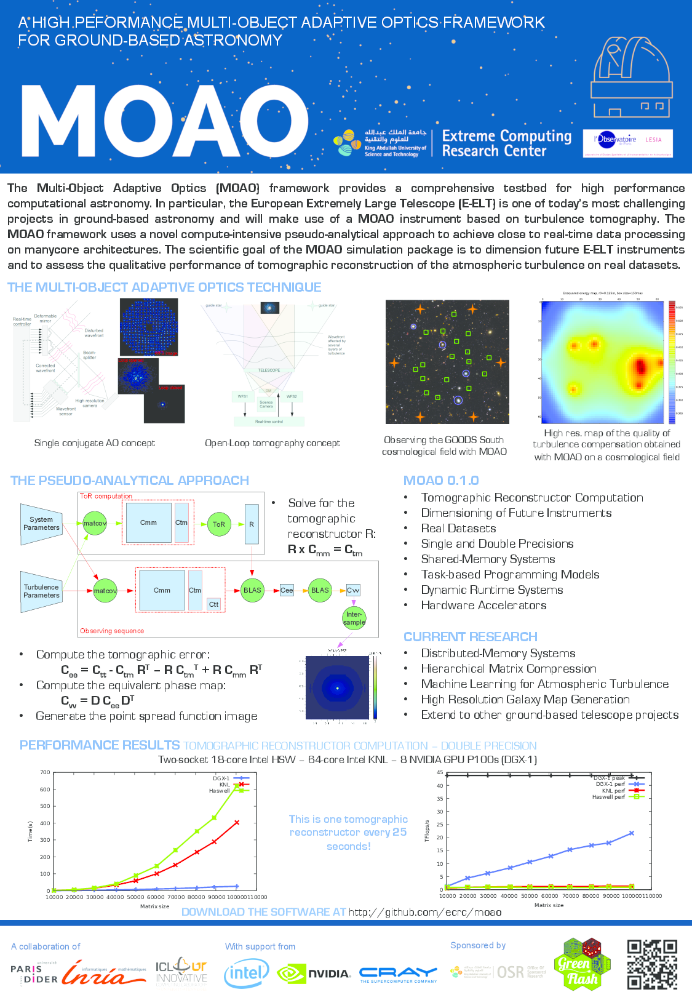

MOAO
========
The MOAO project is an experimental framework for the simulation 
of Multi-Object Adaptive Optics systems.
Using a pseudo-analytical approach leveraged by the computational power of 
manycore architectures (x86 and GPUs), the MOAO framework calculates 
the Tomographic Reconstructor matrix and generates Point Spread Function (PSF)
for arbitrary MOAO systems and atmospheric conditions.

Installation
-------------
First download the sources:
~~~
git clone https://github.com/ecrc/moao MOAO-git
~~~

Then, initialize the submodules:
~~~
cd MOAO-git
git submodule init
git submodule update
~~~

Create a build directory and run CMake:
~~~
mkdir build
cd build
cmake .. -Dproject=chameleon
~~~

The following options can be added:
* -DUSE_INTERSAMPLE=ON to generate PSFs
* -DGPU=ON to enable GPU computation

Finally, compile the project:
~~~
make
~~~

Execution
----------
In order to run the MOAO simulation, some values must be defined:
* the number of core : n_cores
* the number of GPUs (if cuda is enabled): n_gpus
* the tile size : tile
* the number of short exposure performed with a single tomographic reconstructor : maxobs
* the number of tomographic reconstructor used a long exposure : maxrefine
* the path to the system parameters : sys_path
* the path to the atmospheric parameters : atm_path

Run the following command with the actual values:
~~~
./moao --n_cores= --n_gpus= --tile= --maxrefine= --maxobs= --sys_path= --atm_path=
~~~

Inputs
------
The execution of the MOAO framework requires:
* A text file describing the [System parameters](@ref SYS_PARAM)
* A command matrix ( Dx.fits)
* A text file describing the [Atmospheric parameters](@ref ATM_PARAM) 

In order to compute the PSFs, some additional input data are required:
* The influence function of the actuators (abs2fi.fits)
* The list of valid subapertures (idx.fits)
* The optical transfer function of the telescope (otftel.fits)

All those files can be generated by a provided [python script](@ref PY_README) relying on cython.

Input samples can be downloaded as follow :
~~~
wget --quiet --no-check-certificate  "https://drive.google.com/uc?export=download&id=0Bw6iRA3hQZNCVEtVRjA1Q2xwM00" -O moao_inputs.tar.gz
~~~
These samples contain the corresponding PSF output for a single iteration (maxrefine=1, maxobs=1)

Dependencies
------------
This project has several dependencies listed below.

### Simulation ###

* chameleon     (https://project.inria.fr/chameleon/)
* starpu        (http://starpu.gforge.inria.fr/)
* cfitsio       (https://heasarc.gsfc.nasa.gov/fitsio/)
* fftw3         (http://www.fftw.org/)

And, optionally: 
* cuda

### Parameter generation ###
In addition to the dependencies mentioned above,
the parameter generation, detailed in [cython/pipeline/README.md](@ref PY_README) depends on:

* python2

with the packages

* astropy
* cython 

Note that installing anaconda2 (https://conda.io/docs/user-guide/install/download.html) 
provide all these dependencies.

References
==========
1. H. Ltaief, D. Gratadour, A. Charara, and E. Gendron, Adaptive Optics Simulation for the
World's Biggest Eye on Multicore Architectures with Multiple GPUs, *ACM Platform for
Advanced Scientific Computing*, 2016.
2. E. Gendron, A. Charara, A. Abdelfattah, D. Gratadour, D. Keyes, H. Ltaief, C. Morel, F.
Vidal, A. Sevin, and G. Rousset, A Novel Fast and Accurate Pseudo-Analytical Simulation Approach
for MOAO", *in Adaptive Optics Systems IV, Proceedings of the SPIE 9148*, 2014.
3. A. Charara, H. Ltaief, D. Gratadour, D. Keyes, A. Sevin, A. Abdelfattah, E. Gendron and C.
Morel, and F. Vidal, Pipelining Computational Stages of the Tomographic Reconstructor for
Multi-object Adaptive Optics on a Multi-GPU System, *Proceedings of the ACM International
Conference for High Performance Computing, Networking, Storage and Analysis*, pp. 262-273, 2014.
4. A. Abdelfattah, E. Gendron, D. Gratadour, D. Keyes, H. Ltaief, A. Sevin, and F. Vidal, High
Performance Pseudo-analytical Simulation of Multi-Object Adaptive Optics over Multi-GPU
Systems, *Proceedings of the 20th International Euro-Par Conference*, vol. 8632, pp .704–715, 2014.

Questions?
==========
Please feel free to create an issue on Github for any questions and inquiries.

Handout
========

